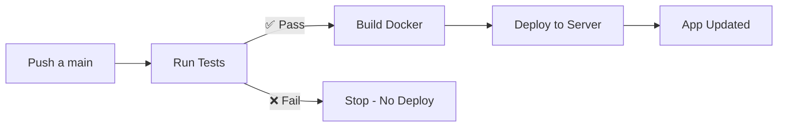

# 🚀 Inicio Rápido - CI/CD y Docker

## ✅ Lo que ya está configurado

1. **✅ Dockerfile** - Contenedor nginx optimizado
2. **✅ docker-compose.yml** - Orquestación multi-proyecto
3. **✅ GitHub Actions** - CI/CD completo (.github/workflows/ci-cd.yml)
4. **✅ Pruebas automatizadas** - Script CLI listo
5. **✅ Nginx Proxy** - Para manejar múltiples proyectos
6. **✅ Scripts de deployment** - deploy.sh y deploy.ps1

---

## 📦 Respuesta a tus dudas

### 1️⃣ ¿Puedo tener 2 proyectos en el mismo servidor?

**SÍ. Tienes 3 opciones:**

#### ✅ Opción A: Puertos diferentes (RECOMENDADO - MÁS SIMPLE)
```yaml
# Ya configurado en docker-compose.yml
- Proyecto existente: puerto 3000
- Cafetería: puerto 8080

# Acceso:
http://tu-servidor:3000  → Proyecto existente
http://tu-servidor:8080  → Cafetería
```

#### ✅ Opción B: Proxy reverso con rutas
```yaml
# Con nginx-proxy service
http://tu-servidor/          → Proyecto existente
http://tu-servidor/cafeteria → Cafetería
```

#### ✅ Opción C: Subdominios
```yaml
http://app.tudominio.com       → Proyecto existente
http://cafeteria.tudominio.com → Cafetería
```

### 2️⃣ ¿Se puede hacer CI/CD?

**SÍ, YA ESTÁ CONFIGURADO** ✅

El workflow hace:
```
COMMIT → TESTS → ❌ Falla? STOP
                 ✅ Pasa? → BUILD → DEPLOY
```

---

## 🏃 Inicio Rápido

### Paso 1: Configurar GitHub Secrets

Ve a tu repo → **Settings** → **Secrets and variables** → **Actions**

Agrega estos secrets:
```
SERVER_HOST      = tu-ip-o-dominio.com
SERVER_USER      = tu-usuario-ssh
SSH_PRIVATE_KEY  = (contenido de tu clave privada SSH)
SERVER_PORT      = 22
```

**Generar clave SSH:**
```bash
ssh-keygen -t ed25519 -C "github-actions"
ssh-copy-id usuario@tu-servidor
cat ~/.ssh/id_ed25519  # Copia esto al secret SSH_PRIVATE_KEY
```

### Paso 2: Desplegar localmente (Primera vez)

**Windows (PowerShell):**
```powershell
.\deploy.ps1 setup
```

**Linux/Mac:**
```bash
chmod +x deploy.sh
./deploy.sh setup
```

Esto ejecuta:
- ✅ Instala dependencias
- ✅ Ejecuta pruebas
- ✅ Construye Docker
- ✅ Inicia contenedor

**Accede:** http://localhost:8080

### Paso 3: Push a GitHub (Activa CI/CD)

```bash
git add .
git commit -m "feat: configurar CI/CD"
git push origin main
```

Ve a **GitHub** → **Actions** para ver el progreso.

---

## 🐳 Comandos Docker

### Despliegue básico
```bash
# Construir imagen
docker build -t cafeteria-app .

# Ejecutar contenedor
docker run -d -p 8080:80 --name cafeteria cafeteria-app

# Ver logs
docker logs -f cafeteria

# Detener
docker stop cafeteria
docker rm cafeteria
```

### Con docker-compose
```bash
# Iniciar todo
docker-compose up -d

# Ver logs
docker-compose logs -f cafeteria

# Detener
docker-compose down

# Reconstruir y reiniciar
docker-compose up -d --build
```

---

## 🔧 Múltiples proyectos

### Edita `docker-compose.yml`:

```yaml
services:
  # Tu proyecto existente (descomenta y ajusta)
  proyecto-existente:
    image: tu-imagen
    ports:
      - "3000:3000"
    networks:
      - app-network

  # Cafetería (ya configurado)
  cafeteria:
    build: .
    ports:
      - "8080:80"
    networks:
      - app-network
```

**¿Quieres usar proxy?** → Descomenta el servicio `nginx-proxy` en docker-compose.yml

---

## 🧪 Pruebas

```bash
# Ejecutar pruebas
npm test

# Instalar dependencias primero
npm install
```

Las pruebas DEBEN pasar antes de deployar.

---

## 📋 Comandos Útiles

### Con scripts de deploy:

**Windows:**
```powershell
.\deploy.ps1 test      # Ejecutar pruebas
.\deploy.ps1 build     # Construir imagen
.\deploy.ps1 start     # Iniciar contenedores
.\deploy.ps1 stop      # Detener contenedores
.\deploy.ps1 restart   # Reiniciar contenedores
.\deploy.ps1 logs      # Ver logs
.\deploy.ps1 status    # Ver estado
.\deploy.ps1 update    # Actualizar app
```

**Linux/Mac:**
```bash
./deploy.sh test
./deploy.sh build
./deploy.sh start
./deploy.sh logs
./deploy.sh update
```

### Docker directo:

```bash
# Ver contenedores
docker ps

# Ver logs
docker logs cafeteria-app

# Entrar al contenedor
docker exec -it cafeteria-app sh

# Ver uso de recursos
docker stats
```

---

## 🚨 Troubleshooting

### Las pruebas fallan
```bash
npm install
npm test
# Lee el error y corrige
```

### Puerto 8080 ocupado
```bash
# Windows
netstat -ano | findstr :8080

# Linux/Mac
lsof -i :8080

# Cambiar puerto en docker-compose.yml:
ports:
  - "9090:80"  # Usa puerto 9090 en lugar de 8080
```

### GitHub Actions falla
1. Ve a **Actions** → click en el workflow fallido
2. Ve el log del paso que falló
3. Ejecuta las pruebas localmente: `npm test`
4. Verifica los secrets de GitHub

### No puedo acceder al servidor
```bash
# Verifica firewall (Linux)
sudo ufw allow 8080

# Verifica que el contenedor esté corriendo
docker ps | grep cafeteria
```

---

## 📁 Estructura de archivos creados

```
.
├── .github/
│   └── workflows/
│       └── ci-cd.yml          # GitHub Actions workflow
├── proxy-config/              # Configuración nginx proxy
│   ├── nginx.conf
│   └── conf.d/
│       └── default.conf
├── tests/
│   └── cli-runner.js          # Runner para CI/CD
├── Dockerfile                 # Imagen Docker optimizada
├── docker-compose.yml         # Orquestación servicios
├── nginx.conf                 # Configuración nginx app
├── .dockerignore              # Archivos excluidos de Docker
├── .env.example               # Variables de entorno ejemplo
├── deploy.sh                  # Script deploy Linux/Mac
├── deploy.ps1                 # Script deploy Windows
├── DEPLOYMENT.md              # Documentación completa
└── QUICKSTART.md              # Este archivo
```

---

## 🎯 Workflow CI/CD



---

## ✅ Checklist de deployment

- [ ] Dependencias instaladas (`npm install`)
- [ ] Pruebas pasan (`npm test`)
- [ ] GitHub Secrets configurados
- [ ] Servidor tiene Docker instalado
- [ ] Puerto 8080 disponible (o cambiado en config)
- [ ] SSH funcionando al servidor
- [ ] Primer deployment manual (`./deploy.ps1 setup`)
- [ ] Push a GitHub para CI/CD automático

---

## 📚 Más información

- **Documentación completa:** Ver `DEPLOYMENT.md`
- **GitHub Actions:** `.github/workflows/ci-cd.yml`
- **Docker Compose:** `docker-compose.yml`

---

## 🎉 ¡Listo!

Tu aplicación ahora tiene:
- ✅ CI/CD automático con GitHub Actions
- ✅ Docker containerizado
- ✅ Pruebas automáticas antes de deploy
- ✅ Soporte para múltiples proyectos
- ✅ Scripts de deployment automatizados

**Para deployar:** Solo haz `git push` y GitHub Actions hace el resto.
